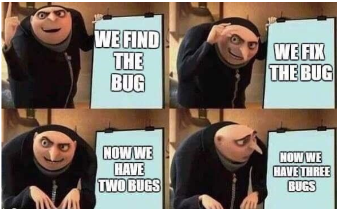
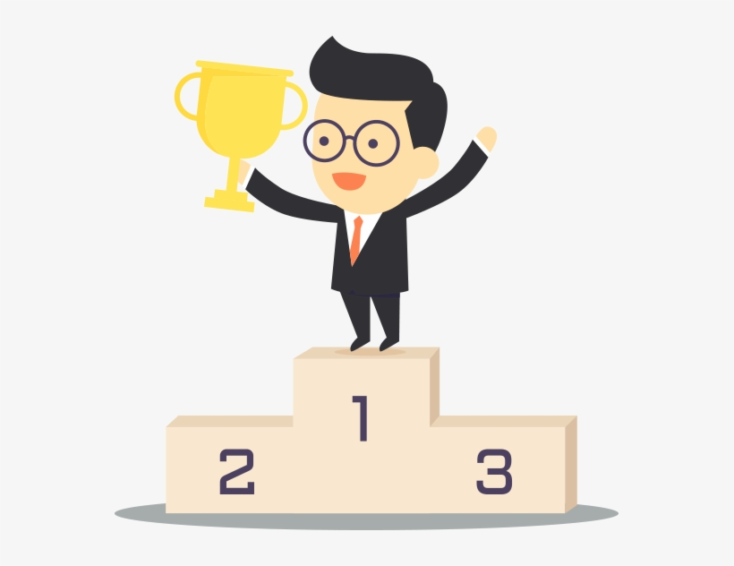
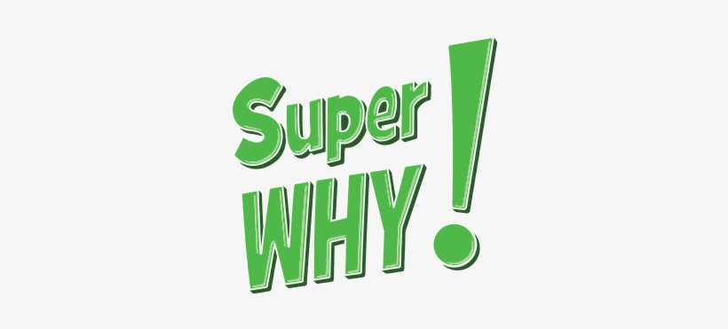
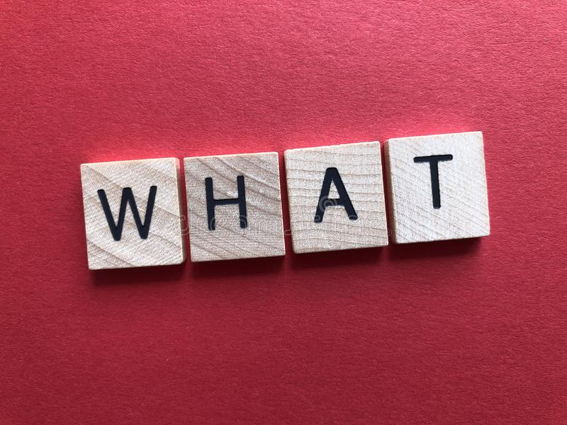
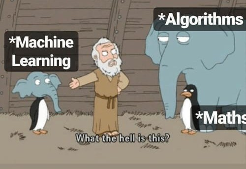

# Can we guess the accurate price!?
Fellow pythons! Welcome to the first - and most likely last - wager activity of our bootcamp!


# Objective



Our goal is to enjoy, please do not take this readme seriously and keep reading at you own risk :)

## Why to participate?




1) Parts of the earnings will be donated to create the "pandas-alatake" fund, so we can finally buy the stuff we need to prank UX and Web!!!

2) Because the other part of the earnings will be distributed among the winners!

## How to participate?


1) Our class is divided between 5 groups, with 5 seeds: Diego, Eva, Marc, Rodrigo, Victor and the rest of us.

2) Each group (not team!! since the competition is individual) will have three members, as follows:

    Group1: Diego - Juana - Pablo

    Group2: Eva - Antonio - Cesar

    Group3: Marc - Jesus - Isa

    Group4: Rodrigo - Mary - Ricardo

    Group5: Victor - Sergio - Mario

3) To participate, **and help us fund money towards the pranks**, until Monday 21, 2021, at 21:21 you can place 5 euros for any group/person. If that group/person wins the competition, then you win!!


### What will you win?


```
def my_wins(total_prize,winning_group_holders):
    return 
        print(Winners take: (total_prize*.8) / winning_group_holders)
        print(Pranks money: total_prize*.2)
```
In the rare event that a winning group had no holders, then we will have to reconsider our highly expensive pranks :D.

## Last words

This event is mainly to fund our pranks money and to have fun during the final presentation.
This repository is not trying to foment gambling or any related activity.

**Lets enjoy our project without to much overfitting!!**

